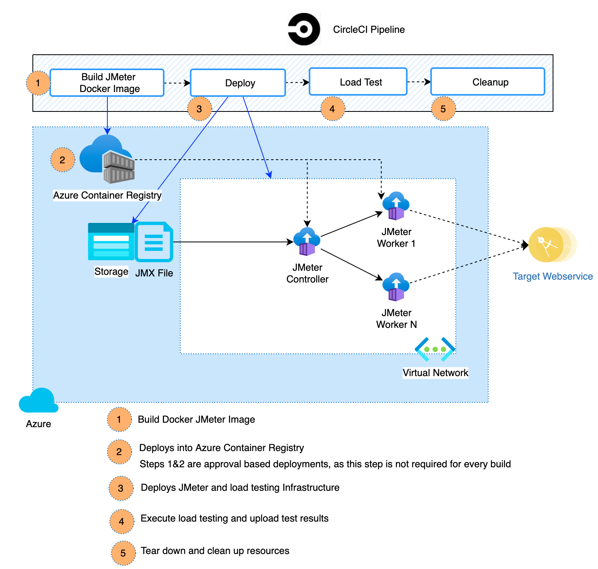

# Load Testing Infrastructure

The purpose of this repository is to demonstrate the two different approaches of load testing.

1. End-to-end scalable infrastructure running a distributed Apache JMeter based load
tests orchestrated with a CircleCI pipeline.
1. Leveraging Azure Load Test (Azure Resource) to orchestrate tests (*coming soon*)

## Container based JMeter Load Tests

This approach leverages Apache JMeter as an open source load and performance testing
tool and uses Terraform to dynamically provision required infrastructure, run load
tests and tear down the infrastructure.

The pipeline includes two workflows

- One workflow `build_jmeter_docker_image`, builds a custom JMeter Docker container
and pushes the image to Azure Container Registry (ACR).

- Workflow `build_deploy_loadtest`, dynamically provisions load testing
infrastructure. The load test is then run, and test results are published. The
provisions infrastructure is destroyed after the run is complete.

    The `build_deploy_loadtest` testing pipeline consists of the following steps -

        - create infrastructure on-demand
        - deploy the infrastructure
        - execute load tests
        - report test results
        - destroy infrastructure

## Getting Started

1. Clone the GitHub repository to get started by connecting to your CircleCI account
and `.circleci/config.yml`.

1. [Create a Service Principal](https://docs.microsoft.com/en-us/azure/active-directory/develop/app-objects-and-service-principals#service-principal-object). Gather Client ID, Client Secret and Azure Service Connection Name for adding them
to Environment Variables list.

1. Create Environment Variables in the CircleCI Project settings.

    1. ARM_CLIENT_ID - Application/Client ID of the
    1. ARM_CLIENT_SECRET
    1. ARM_SUBSCRIPTION_ID
    1. ARM_TENANT_ID
    1. DOCKER_PASS
    1. DOCKER_USERNAME
    1. JMETER_DOCKER_IMAGE
    1. LOCATION

1. The worker node count can be changed with updates to variable `JMETER_WORKERS_COUNT` in the `terraform/variables.tf` file.

> *Note: The `sample-loadtest.jmx` file is a very simple load test file to demonstrate the pipeline capabilities and does not excercise any true load tests.*